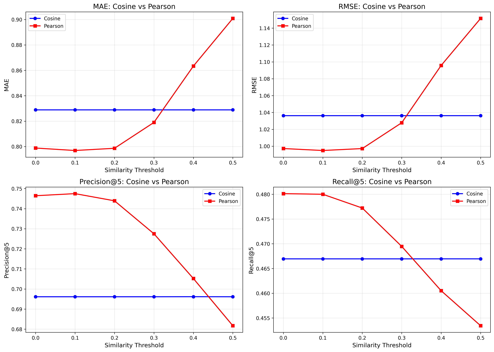
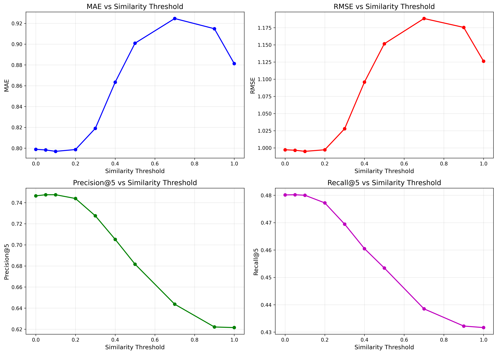
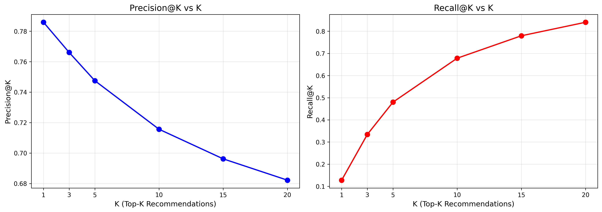
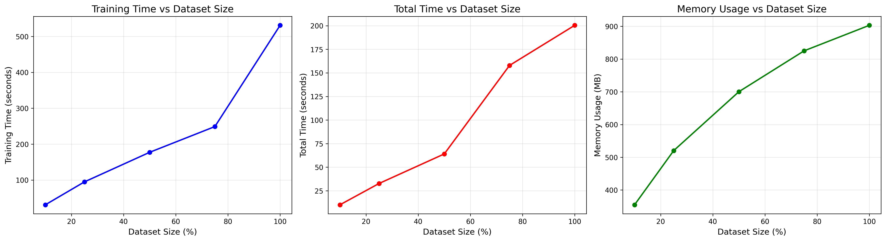
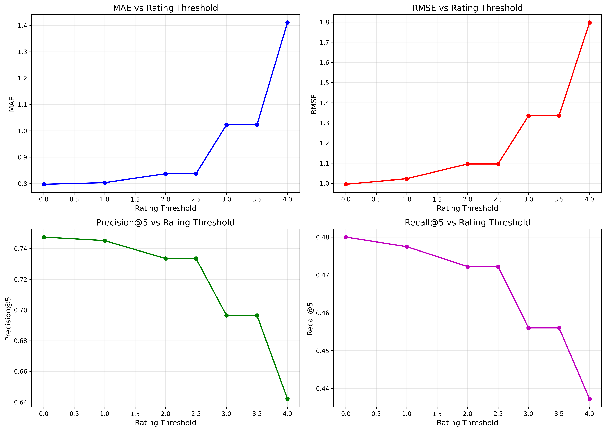

# Movie Recommendation System (Collaborative Filtering)

## Project Overview

This project implements an **item-item collaborative filtering** recommendation system for movies.  
The program predicts ratings for movies a user has not yet seen and recommends movies with the highest predicted ratings.

## Features

- Uses **item-item collaborative filtering** based on Pearson similarity.
- Efficient data structures: dict-of-dict for ratings and similarity matrices, dict-of-sets for movies-user mapping.
- Command-line interface: take a CSV file of ratings and an optional similarity threshold.
- Optimized for sparse datasets with thousands of users and movies.

## Requirements- Python 3.x

- Libraries: `numpy`, `pandas`

## Usage Instructions

Run the program from the command line:

`python recommend.py <ratings_file.csv> <similarity_threshold>`

`<ratings_file.csv>`: CSV file with user-movie ratings

`<similarity_threshold>` (optional): filter out weak recommendations (default = 0.1)

Example:

`python recommend.py sample_ratings.csv 0.1`

Sample Output:

```
0 12 4.5
1 34 3.9
...
```

## Algorithm & Implementation Notes

- **Collaborative filtering type:** Item-item (more efficient for this dataset).
- **Similarity metric:** Pearson similarity (more accurate than cosine).
- **Data structures:**
  - `ratings matrix` → dict-of-dict
  - `movies_user matrix` → dict-of-sets
  - `similarity matrix` → full symmetric dict-of-dict for fast lookup
- **Optimizations:** Full symmetric similarity matrix for faster computation (~60% faster runtime than triangular).
- **Prediction formula:**
  predicted_rating(u, m) = Σ(sim(m, i) × rating(u, i)) / Σ(sim(m, i))

# Results & Evaluation

## Performance Metrics

- **MAE:** 0.797
- **RMSE:** 0.995
- **Precision@5:** 0.748
- **Recall@5:** 0.480

_Evaluated on 80/20 train/test split with Pearson correlation and similarity threshold of 0.1_

## Experimental Analysis

### 1. Similarity Metric Comparison



**Key Finding:** Pearson correlation significantly outperforms cosine similarity across all metrics since Pearson accounts for user rating bias by centering the data.

| Metric      | Cosine | Pearson |
| ----------- | ------ | ------- |
| MAE         | 0.830  | 0.797   |
| RMSE        | 1.040  | 0.995   |
| Precision@5 | 0.696  | 0.748   |

### 2. Similarity Threshold Optimization



The similarity threshold controls which neighbors are considered when making predictions.

- **Optimal range:** 0.0 - 0.1 (best MAE/RMSE and precision/recall)
- **Medium thresholds (0.5-0.7):** Worst performance - filters out too many neighbors, causing predictions to fall back to user means
- **High thresholds (>0.8):** Slight improvement but still worse than low thresholds

Threshold = 0.1 seems to give the best recommendation quality and performance.

---

### 3. Top-K Recommendations Analysis



The value of k determines how many movies to recommend per user

- **Precision@K** decreases as K increases (78.5% @ K=1 → 68.3% @ K=20)
- **Recall@K** increases as K increases (13.0% @ K=1 → 84.2% @ K=20)

K=5 provides an optimal balance with 75% precision and 48% recall.

### 4. Scalability Analysis



### 5. Rating Threshold Impact



The rating threshold filters which movies from a user's ratings are used for prediction (eg. only use movies rated > 3.0).

**Results:** Filtering training data in this way degrades performance. This is probably because it reduces the available data for the model to learn from, leading predictions to use global average, which decreases accuracy and recommendation quality. Rating threshold = 0 provides best performance.

---

## Configuration Recommendations

Based on experimental results:

```python
similarity_metric = 'pearson'
similarity_threshold = 0.1
rating_threshold = 0  # Don't filter training data
top_k = 5
relevant_threshold = 4.0  # For evaluation
```
